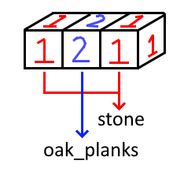
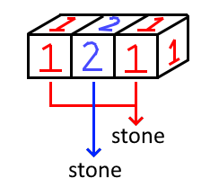

# NBTPaletteChanger

## Description

NBTPaletteChanger is a python tool that uses string replacements to change the block palette of structures files (`.nbt`) in a folder.

All occurrences of the specified term in the block palette will be replaced with the new term.

## Prerequisites

- **Python 3.8/3.9 or superior is required.**

To locate your python install, open a new terminal:  
Windows: `where python`  
Linux/MacOS: `whereis python` or `which python`

To identify the version of Python you are using, in a terminal type:  
`python --version`

If your version is outdated, download a more recent one from the Python website [https://www.python.org/downloads/](https://www.python.org/downloads/).

- **[NBTLib](https://github.com/vberlier/nbtlib) is required.**

You can install NBTLib from the Python package index ([https://pypi.org/project/nbtlib/](https://pypi.org/project/nbtlib/)), using this command (you may need to use an elevated terminal):  
`pip install nbtlib`.

:warning: If you get any of the similar messages when installing nbtlib, you might have to add the mentioned scripts folder to your `path` variable.

<mark> WARNING: The script nbt.exe is installed in 'C:\Users\User\AppData\Local\Packages\PythonSoftwareFoundation.Python.3.9_qbz5n2kfra8p0\LocalCache\local-packages\Python39\Scripts' which is not on PATH </mark>

<mark> WARNING: The script nbt.exe is installed in 'C:\Python310\Scripts' which is not on PATH </mark>

The `path` variable is accessed on Windows by pressing "Windows + R" and inputting `SystemPropertiesAdvanced` in the box (and selecting 'Ok'), then clicking the "Environment Variables" button. Then choose to add that folder on your user or system variables, both would work.

:bulb: After installing dependencies, updating Python, updating `path`, etc. it might be wise to **restart your terminal** so that it can pickup changes to your `path` environment variable.

## Functionality

Structure files store numbers for a given (x, y, z) coordinate instead of names representing the blocks.

The names representing the blocks are stored in what's called the block palette, meaning that the leftmost and rightmost blocks in this picture use the same palette, but each stores the same number, `1`, which has a palette of `stone`.

If we want to replace the oak planks with stone, we simply have to replace `oak_planks` with `stone` as well. Note that the blocks will keep the same number stored, but their palette will change and be stored for each different number.

Although this could be considered redundant data, it will not affect the integrity of the structure file.

## Usage

NBTPaletteChanger will match all substrings contained within the block palette.  
If you need NBTPaletteChanger to match full terms only instead, add the `--exact` argument when calling it in the terminal.

`NBTPaletteChanger.py [--exact]`

e.g.  
Windows

- `NBTPaletteChanger.py`
- `NBTPaletteChanger.py --exact`

Linux/MacOS

- `./NBTPaletteChanger.py`
- `./NBTPaletteChanger.py --exact`

1. Download the script: [NBTPaletteChanger.py](./assets/NBTPaletteChanger.py)
2. Make a copy of your structure files and you'll work with that copy (VERY IMPORTANT!)
3. Give appropriate permissions to the script if appropriate (`chmod +x`) and call it in a terminal
4. At the question `Input folder:`, give a root folder that contains structure files (searches full depth of that folder) e.g. `C:\jigsaw\structures\stony_structures_copy`
5. At the question `String to find:`, give a material to look for while being as precise as possible e.g. `minecraft:oak_planks` or `minecraft:oak`
6. At the question `String to replace to:`, give a material to replace the previous one e.g. `minecraft:acacia_planks` or `minecraft:acacia`
7. Follow the output on screen
